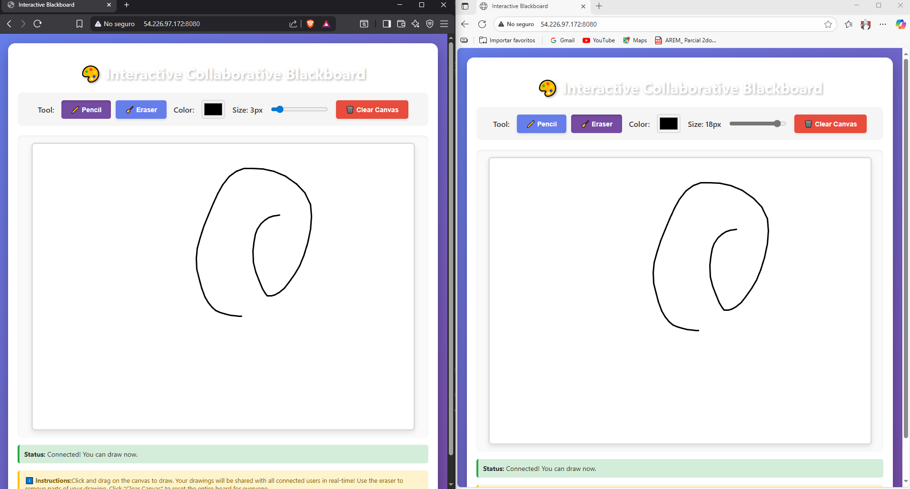

# ARSW-lab6 - Interactive Collaborative Blackboard

Aplicación web de tablero interactivo colaborativo en tiempo real desarrollada con Spring Boot, WebSockets, React y P5.js.



## 🎥 Video demostracion

**[▶️ Ver video de despliegue en Azure](https://pruebacorreoescuelaingeduco-my.sharepoint.com/:v:/g/personal/juan_rpenuela_mail_escuelaing_edu_co/EZ_-gP62_ntPnJTwOTL4vxEBYgXfwOeOBR--D5R5nBZ8OQ?nav=eyJyZWZlcnJhbEluZm8iOnsicmVmZXJyYWxBcHAiOiJPbmVEcml2ZUZvckJ1c2luZXNzIiwicmVmZXJyYWxBcHBQbGF0Zm9ybSI6IldlYiIsInJlZmVycmFsTW9kZSI6InZpZXciLCJyZWZlcnJhbFZpZXciOiJNeUZpbGVzTGlua0NvcHkifX0&e=grfHe9)**

Este video muestra la aplicación desplegada y funcionando en AWS, demostrando la sincronización en tiempo real entre múltiples clientes.

## 📋 Descripción

Esta aplicación permite a múltiples usuarios dibujar simultáneamente en un lienzo compartido. Todos los trazos realizados por cualquier usuario se sincronizan en tiempo real con todos los demás clientes conectados, permitiendo una experiencia de dibujo colaborativo.

## 🏗️ Arquitectura Técnica

### Backend (Spring Boot)

#### Tecnologías
- **Spring Boot 3.1.1**: Framework principal
- **Spring WebSocket**: Comunicación bidireccional en tiempo real
- **STOMP Protocol**: Protocolo de mensajería sobre WebSocket
- **SockJS**: Fallback para navegadores sin soporte WebSocket nativo
- **Java 17**: Versión del lenguaje

#### Componentes principales

**1. WebSocketConfig.java**
```java
@Configuration
@EnableWebSocketMessageBroker
public class WebSocketConfig implements WebSocketMessageBrokerConfigurer
```
- Configura el broker de mensajes STOMP
- Define el endpoint WebSocket: `/bbService`
- Configura prefijos de destino:
  - `/app`: Para mensajes del cliente al servidor
  - `/topic`: Para broadcast del servidor a los clientes
- Habilita SockJS como fallback

**2. Modelos de datos**

- **Point.java**: Representa coordenadas (x, y) en el canvas
- **DrawingUpdate.java**: Encapsula la información de cada trazo:
  - `start`: Punto inicial
  - `end`: Punto final
  - `color`: Color del trazo
  - `strokeWeight`: Grosor del trazo
  - `tool`: Herramienta usada (pencil/eraser)

**3. DrawingServiceController.java**
```java
@MessageMapping("/draw")
@SendTo("/topic/drawings")
public DrawingUpdate handleDrawing(DrawingUpdate drawingUpdate)
```
- `@MessageMapping("/draw")`: Escucha mensajes en `/app/draw`
- `@SendTo("/topic/drawings")`: Broadcast a todos los suscritos
- `handleDrawing()`: Retransmite las actualizaciones de dibujo
- `handleClear()`: Gestiona el evento de limpiar canvas

### Frontend (React + P5.js)

#### Tecnologías
- **React 18**: Framework de UI
- **P5.js**: Librería de dibujo creativo
- **STOMP.js**: Cliente STOMP para WebSocket
- **SockJS Client**: Cliente WebSocket con fallback
- **Babel Standalone**: Transpilación JSX en tiempo real

#### Componente Principal: InteractiveBlackboard

**Estado del componente:**
```javascript
state = {
    currentColor: '#000000',      // Color de dibujo actual
    strokeWeight: 3,              // Grosor del trazo
    currentTool: 'pencil',        // Herramienta activa
    connected: false,             // Estado de conexión WebSocket
    statusMessage: 'Connecting...'
}
```

**Funcionalidades:**

1. **Inicialización de P5.js**
   - Canvas de 800x600 píxeles
   - Eventos de mouse: `mousePressed`, `mouseDragged`, `mouseReleased`
   - Renderizado en tiempo real

2. **Conexión WebSocket**
   ```javascript
   connectWebSocket() {
       const socket = new SockJS('/bbService');
       this.stompClient = Stomp.over(socket);
       
       // Suscripción a topics
       this.stompClient.subscribe('/topic/drawings', callback);
       this.stompClient.subscribe('/topic/clear', callback);
   }
   ```

3. **Envío de datos de dibujo**
   - Captura coordenadas del mouse al arrastrar
   - Crea objeto `DrawingUpdate` con información del trazo
   - Envía al servidor mediante `stompClient.send('/app/draw', ...)`

4. **Recepción y renderizado**
   - Escucha mensajes en `/topic/drawings`
   - Parsea JSON recibido
   - Dibuja líneas usando P5.js con los parámetros recibidos

### Interfaz de Usuario

**Toolbar (Barra de herramientas):**
- Selector de herramienta: Lápiz / Borrador
- Selector de color (color picker HTML5)
- Control deslizante de grosor (1-20px)
- Botón "Clear Canvas" para limpiar todo

**Canvas:**
- Área de dibujo de 800x600px
- Cursor en forma de cruz
- Fondo blanco con borde

**Indicadores de estado:**
- Estado de conexión (Conectado/Desconectado)
- Mensajes informativos
- Instrucciones de uso

## 🔄 Flujo de Comunicación

### 1. Conexión inicial
```
Cliente → [HTTP] → Spring Boot (Puerto 8080)
Cliente → [WebSocket Handshake] → /bbService
Cliente → [STOMP CONNECT] → Broker
Cliente → [STOMP SUBSCRIBE] → /topic/drawings
Cliente → [STOMP SUBSCRIBE] → /topic/clear
```

### 2. Evento de dibujo
```
Cliente A dibuja línea
    ↓
Cliente A → [STOMP SEND] → /app/draw → DrawingServiceController
    ↓
DrawingServiceController.handleDrawing()
    ↓
[@SendTo] → /topic/drawings (Broadcast)
    ↓
Todos los clientes suscritos reciben el mensaje
    ↓
Cada cliente dibuja la línea en su canvas
```

### 3. Limpiar canvas
```
Cliente A → [STOMP SEND] → /app/clear
    ↓
[@SendTo] → /topic/clear
    ↓
Todos los clientes limpian su canvas
```

## 📦 Dependencias Maven

```xml
<!-- Spring Boot Parent -->
<parent>
    <groupId>org.springframework.boot</groupId>
    <artifactId>spring-boot-starter-parent</artifactId>
    <version>3.1.1</version>
</parent>

<!-- Dependencias -->
<dependency>
    <groupId>org.springframework.boot</groupId>
    <artifactId>spring-boot-starter-web</artifactId>
</dependency>
<dependency>
    <groupId>org.springframework.boot</groupId>
    <artifactId>spring-boot-starter-websocket</artifactId>
</dependency>
```

## 🚀 Instalación y Ejecución

### Prerrequisitos
- Java 17 o superior
- Maven 3.6+
- Navegador web moderno (Chrome, Firefox, Edge)

### Pasos para ejecutar

1. **Clonar el repositorio**
   ```bash
   git clone https://github.com/Juan-Rpenuela/ARSW-lab6.git
   cd ARSW-lab6
   ```

2. **Compilar y ejecutar con Maven**
   ```bash
   mvn clean spring-boot:run
   ```

3. **Acceder a la aplicación**
   - Abrir navegador en: `http://localhost:8080`
   - Para probar colaboración: abrir múltiples pestañas/ventanas

### Comandos Maven útiles

```bash
# Compilar sin ejecutar tests
mvn clean package -DskipTests

# Solo compilar
mvn clean compile

# Generar JAR ejecutable
mvn clean package
java -jar target/lab6-1.0-SNAPSHOT.jar
```

## 🎨 Características Implementadas

### Funcionalidades de dibujo
- ✅ Dibujo a mano alzada con mouse
- ✅ Selector de color (paleta completa)
- ✅ Control de grosor de línea (1-20px)
- ✅ Herramienta borrador
- ✅ Limpiar canvas completo

### Funcionalidades colaborativas
- ✅ Sincronización en tiempo real
- ✅ Múltiples usuarios simultáneos
- ✅ Broadcast de eventos de dibujo
- ✅ Broadcast de evento "clear"
- ✅ Reconexión automática en caso de desconexión

### Interfaz de usuario
- ✅ Diseño responsivo
- ✅ Indicador de estado de conexión
- ✅ Instrucciones de uso
- ✅ Interfaz intuitiva y moderna
- ✅ Animaciones y transiciones suaves

## 🔧 Configuración

### WebSocket Endpoints

| Endpoint | Tipo | Descripción |
|----------|------|-------------|
| `/bbService` | WebSocket | Endpoint de conexión SockJS |
| `/app/draw` | Message | Envío de trazos de dibujo |
| `/app/clear` | Message | Limpiar canvas |
| `/topic/drawings` | Topic | Broadcast de trazos |
| `/topic/clear` | Topic | Broadcast de limpieza |

### Configuración CORS
- Patrón de orígenes permitidos: `*` (todos)
- Método: `setAllowedOriginPatterns("*")`
- Compatible con SockJS

## 📊 Estructura del Proyecto

```
ARSW-lab6/
├── src/
│   ├── main/
│   │   ├── java/
│   │   │   └── co/edu/escuelaing/interactiveblackboard/
│   │   │       ├── BBAppStarter.java              # Clase principal
│   │   │       ├── config/
│   │   │       │   └── WebSocketConfig.java       # Configuración WebSocket
│   │   │       ├── controllers/
│   │   │       │   └── DrawingServiceController.java  # Controladores
│   │   │       └── model/
│   │   │           ├── Point.java                 # Modelo de punto
│   │   │           └── DrawingUpdate.java         # Modelo de actualización
│   │   └── resources/
│   │       └── static/
│   │           ├── index.html                     # HTML principal
│   │           ├── css/
│   │           │   └── styles.css                 # Estilos
│   │           └── js/
│   │               └── bbComponents.jsx           # Componente React
│   └── test/
│       └── java/
│           └── co/edu/escuelaing/interactiveblackboard/
│               └── AppTest.java
├── pom.xml                                         # Configuración Maven
└── README.md
```

## 🧪 Testing

Para probar la sincronización en tiempo real:

1. Abrir `http://localhost:8080` en una ventana del navegador
2. Abrir la misma URL en otra ventana/pestaña o navegador diferente
3. Dibujar en una ventana y observar cómo aparece en la otra
4. Cambiar colores y grosores en diferentes ventanas
5. Probar el botón "Clear Canvas" desde cualquier ventana

## 📝 Notas Técnicas

### Protocolo STOMP
STOMP (Simple Text Oriented Messaging Protocol) es un protocolo de mensajería que funciona sobre WebSocket, proporcionando:
- Modelo pub/sub (publicación/suscripción)
- Enrutamiento de mensajes
- Confirmaciones de entrega
- Gestión de transacciones

### SockJS
Librería JavaScript que proporciona:
- Abstracción sobre WebSocket
- Fallbacks automáticos (xhr-streaming, xhr-polling, iframe-based)
- API compatible con WebSocket estándar
- Compatibilidad con navegadores antiguos

### P5.js
Librería de dibujo basada en Processing que ofrece:
- API simplificada para canvas HTML5
- Gestión de eventos de mouse/teclado
- Funciones de dibujo 2D
- Renderizado eficiente

## 🐛 Troubleshooting

### Error: "Connection refused"
- Verificar que el servidor Spring Boot esté corriendo
- Confirmar que el puerto 8080 no esté en uso

### Error: "allowedOrigins cannot contain '*'"
- Usar `setAllowedOriginPatterns("*")` en lugar de `setAllowedOrigins("*")`
- Ya está configurado correctamente en este proyecto

### No se ven los dibujos de otros usuarios
- Verificar conexión WebSocket en la consola del navegador
- Confirmar que ambos clientes estén conectados al mismo servidor
- Revisar logs del servidor para errores

## 👨‍💻 Autor

Juan R. Peñuela
